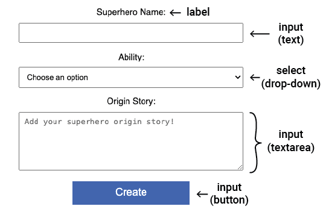

Form elements in HTML allow users to input data, interact with the page, and submit information. 

--- collapse ---

---
title: Types of form elements
---

Here are some useful form elements:
+ `<input>` e.g. single-line text box, checkbox, button.
+ `<select>` A drop-down list.
+ `<textarea>` For entering multiple lines of text.
+ `<label>` Text to tell the user what information to enter.

--- /collapse ---

The `<input>` element can be displayed in many ways using the `type` attribute.

You set the type of input using `type=`.

--- collapse ---

---
title: Examples of input types
---

+ **text:** Single line of text. 

        <input type="text">
*Try it*:
 <input type="text">

+ **password:** Hides the entered text.

        <input type="password">
*Try it*:
 <input type="password">

+ **checkbox:** Tick one or more options.

        <input type="checkbox"> <label>Breakfast</label>
        <input type="checkbox"> <label>Lunch</label>
*Try it*:
 <input type="checkbox"><label>Breakfast</label>
 <input type="checkbox"><label>Lunch</label>

+ **radio:** Select one option from a group.
  
        <input type="radio" name="meal"> <label>Breakfast</label>
        <input type="radio" name="meal"> <label>Lunch</label>

*Try it*:
 <input type="radio" name="meal"><label>Breakfast</label>
 <input type="radio" name="meal"><label>Lunch</label>
 **Tip:** The radio buttons must have the same `name` attribute so that selecting a radio button deselects any other selected radio button. 

**number** Numeric data with arrows to increase/decrease the value 

        <input type="number">
*Try it*:
 <input type="number">

--- /collapse ---

You can add attributes to an `<input>` element that helps the user and controls what can be entered.

--- collapse ---

---
title: Examples of input attributes
---

+ placeholder: provides a hint of what the user should enter. It is replaced when the user enters a value.
Example: `<input type="text" placeholder="Enter your name">`
 <input type="text" placeholder="Enter your name">

+ value: sets the default data entered in the input field. For example in a form where the user is asked for their dietary requirements, you could set the default value of that field to "None".
Example: `<input type="text" name="Dietary requirements" value="None">`
 <input type="text" name="Dietary requirements" value="None">

+ required: checks the input field must be filled out before submitting the form.
Example: `<input type="text" required>`

+ maxlength: sets the maximum number of characters allowed in a text or password input.
Example: `<input type="text" maxlength="3">`
 <input type="text" maxlength="3">

+ min and max: sets the minimum and maximum values for number or date inputs.
Example: `<input type="number" min="0" max="100">`

--- /collapse ---
