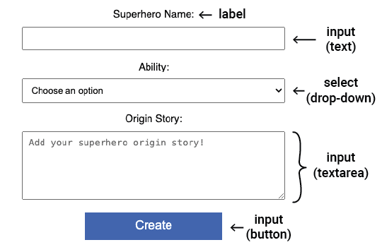

Form elements in HTML allow users to input data, interact with the page, and submit information. 

--- collapse ---

---
title: What are the different types of form elements?
---

Here are some useful form elements:
+ `<form>`: The overall form container.
+ `<label>`: Labels for the input fields.
+ `<input>`: Text inputs, checkboxes, radio buttons, etc.
+ `<button>`: Submit or reset buttons.

--- /collapse ---

The `<input>` element is the most commonly used form element because it allows users add data to a form.

This can be displayed in many ways using the `type` attribute.

--- collapse ---

---
title: What are the form inputs in HTML?
---

+ Text (<input type="text">): allows users to enter a single line of text.
+ Password (<input type="password">): allows text input but hides the entered text for sensitive information.
+ Textarea (<textarea></textarea>): allows users to enter multiple lines of text.
+ Checkbox (<input type="checkbox">): allows users to select one or more options.
+ Radio Button (<input type="radio">): allows users to select a single option.
+ Select Dropdown (<select><option value="1">1</option><option value="2">2</option></select>): creates a dropdown list for users to choose one option.
+ Submit (<input type="submit">): a button that sends the data enetered byt the users on the form.
+ Reset (<input type="reset">): a button that clears all the form fields to their default values.

--- /collapse ---

#### How to add a text input area

--- code ---
---
language: html
filename: comicbook.html
line_numbers: true
---

      

        <label>Superhero Name:</label>
        <input type="text" id="name-text">     
      

    
--- /code ---

#### How to add a text area

--- code ---
---
language: html
filename: comicbook.html
line_numbers: true
---

    

      <label>Appearance: </label> 
      <textarea id="appearance-text" placeholder="Type the appearance of your superhero here...."></textarea>
    

    
--- /code ---

#### How to add a drop down list

--- code ---
---
language: html
filename: comicbook.html
line_numbers: true
---
   
      

        <label>Abilities:</label>
        <select id="ability-choice">
          <option value="">Choose an option</option>
          <option value="Flying">Flying</option>
          <option value="Invisibility">Invisibility</option>
          <option value="Time travel">Time travel</option>
        </select>
      

    
--- /code ---

#### How to add a checkbox

--- code ---
---
language: html
filename: comicbook.html
line_numbers: true
---

      

        <label>Accept Terms:</label>
        <input type="checkbox" id="accept-box">     
      

    
--- /code ---

#### How to add a button element

--- code ---
---
language: html
filename: comicbook.html
line_numbers: true
---

    <button onclick="displaySummary()">Create</button>

--- /code ---

**TODO** Check where this can go:

--- collapse ---

---
title: Examples of input attributes
---

+ placeholder: provides a short hint that describes the expected value of the input field and is replaced when the user enters a value.
Example: `<input type="text" placeholder="Enter your name">`

+ value: sets the default data entered in the input field. For example in a form where the user is asked for their dietary requirements, you could set the default value of that field to "None".
Example: `<input type="text" name="Dietary requirements" value="None">`

+ required: ensures that the input field must be filled out before submitting the form.
Example: `<input type="text" required>`

+ maxlength: sets the maximum number of characters allowed in a text or password input.
Example: `<input type="text" maxlength="30">`

+ min and max: sets the minimum and maximum values for number or date inputs.
Example: `<input type="number" min="0" max="100">`

--- /collapse ---
