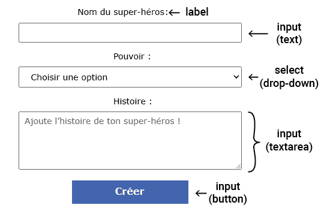

Les éléments de formulaire en HTML permettent aux utilisateurs de saisir des données, d'interagir avec la page et de soumettre des informations.



\--- collapse ---

---

## title: Types d'éléments de formulaire

Voici quelques éléments de formulaire utiles :

- `<input>` Une zone de texte sur une seule ligne, une case à cocher ou un bouton, par exemple
- `<select>` Une liste déroulante
- `<textarea>` Pour entrer plusieurs lignes de texte
- `<label>` Texte pour indiquer à l'utilisateur quelles informations entrer

\--- /collapse ---

L'élément `<input>` peut être affiché de plusieurs façons en utilisant l'attribut `type`.

Tu définis le type d'entrée en utilisant `type=`.

\--- collapse ---

---

## title: Exemples de types d'entrée

- **texte :** une seule ligne de texte.

        ```
          <input type="text">
        ```

**Essaie-le** : <br><input type="text">

- **mot de passe :** masque le texte entré.

        ```
          <input type="password">
        ```

**Essaie-le** : <br><input type="password">

- **case à cocher :** coche une ou plusieurs options.

        ```
          <input type="checkbox"> <label>Petit-déjeuner</label>
          <input type="checkbox"> <label>Déjeuner</label>
        ```

**Essayez-le** : <br><input type="checkbox"><label>Petit-déjeuner</label> <br><input type="checkbox"><label>Déjeuner</label>

- **radio :** sélectionne une option dans un groupe.

        ```
          <input type="radio" name="meal"> <label>Petit-déjeuner</label>
          <input type="radio" name="meal"> <label>Déjeuner</label>
        ```

**Essaie-le** : <br><input type="radio" name="meal"><label>Petit déjeuner</label> <br><input type="radio" name="meal"><label>Déjeuner</label> <br>**Astuce :** les boutons radio doivent avoir le même attribut `name` afin que la sélection d'un bouton radio désélectionne tout autre bouton radio sélectionné.

- **nombre** : données numériques avec des flèches pour augmenter/diminuer la valeur.

        ```
          <input type="number">
          
        ```

**Essaie-le** : <br><input type="number">

\--- /collapse ---

Tu peux ajouter des attributs à un élément `<input>` pour aider l'utilisateur et contrôler ce qui peut être saisi.

\--- collapse ---

---

## title: Exemples d'attributs d'entrée

- placeholder : fournit une indication de ce que l'utilisateur doit saisir. Il est remplacé lorsque l'utilisateur entre une valeur.
        Exemple : `<input type="text" placeholder="Enter your name">` <br><input type="text" placeholder="Enter your name">

- valeur : définit les données par défaut saisies dans le champ de saisie. Par exemple, dans un formulaire où l'on demande à l'utilisateur ses besoins alimentaires, tu peux définir la valeur par défaut de ce champ sur « Aucun ».
        Exemple : `<input type="text" name="Dietary requirements" value="None">` <br><input type="text" name="Dietary requirements" value="None">

- obligatoire : vérifie que le champ de saisie est rempli avant d'autoriser la soumission du formulaire.
        Exemple : `<input type="text" required>`

- maxlength : définit le nombre maximal de caractères autorisés dans une saisie de texte ou de mot de passe.
        Exemple : `<input type="text" maxlength="3">` <br><input type="text" maxlength="3">

- min et max : définit les valeurs minimales et maximales pour les entrées de nombre ou de date.
        Exemple : `<input type="number" min="0" max="100">`

\--- /collapse ---
