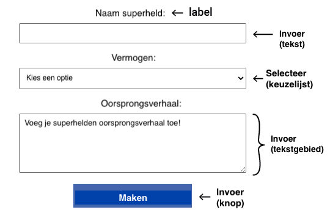

Met formulierelementen in HTML kunnen gebruikers gegevens invoeren, met de pagina communiceren en informatie verzenden.



\--- collapse ---

---

## title: Typen formulierelementen

Hier zijn enkele nuttige formulierelementen:

- `<input>` Een tekstvak met één regel, selectievakje of knop, bijvoorbeeld
- `<select>` Een keuzelijst
- `<textarea>` Voor het invoeren van meerdere tekstregels
- `<label>` Tekst om de gebruiker te vertellen welke informatie hij moet invoeren

\--- /collapse ---

Het element `<input>` kan op verschillende manieren worden weergegeven met behulp van het kenmerk `type`.

Je stelt het type invoer in met `type=`.

\--- collapse ---

---

## title: Voorbeelden van invoertypes

- **text:** Eén regel tekst.

        ```
          <input type="text">
        ```

\*_Probeer het_: <br><input type="text">

- **password:** Verbergt de ingevoerde tekst.

        ```
          <input type="password">
        ```

\*_Probeer het_: <br><input type="password">

- **checkbox:** Selecteer een of meer opties.

        ```
          <input type="checkbox"> <label>Ontbijt</label>
          <input type="checkbox"> <label>Lunch</label>
        ```

**Probeer het**: <br><input type="checkbox"><label>Ontbijt</label> <br><input type="checkbox"><label>Lunch</label>

- **radio:** Selecteer één optie uit een groep.

        ```
          <input type="radio" name="meal"> <label>Ontbijt</label>
          <input type="radio" name="meal"> <label>Lunch</label>
        ```

**Probeer het**: <br><input type="radio" name="meal"><label>Ontbijt</label> <br><input type="radio" name="meal"><label>Lunch</label> <br>**Tip:** De keuzerondjes moeten hetzelfde `name`-kenmerk hebben, zodat wanneer je een keuzerondje selecteert, alle andere geselecteerde keuzerondjes worden gedeselecteerd.

- **number:** Numerieke data met pijlen om de waarde te verhogen/verlagen.

        ```
          <input type="number">
          
        ```

**Probeer het**: <br><input type="number">

\--- /collapse ---

Je kunt attributen toevoegen aan een `<input>` element om de gebruiker te helpen en te bepalen wat kan worden ingevoerd.

\--- collapse ---

---

## title: Voorbeelden van invoerattributen

- placeholder: Geeft een hint van wat de gebruiker moet invoeren. Deze wordt vervangen wanneer de gebruiker een waarde invoert.
        Voorbeeld: `<input type="text" placeholder="Enter your name">` <br><input type="text" placeholder="Enter your name">

- value: Hiermee stel je de standaardgegevens in die in het invoerveld worden ingevoerd. In een formulier waarin de gebruiker wordt gevraagd naar zijn/haar dieetwensen, kun je bijvoorbeeld de standaardwaarde van dat veld instellen op 'Geen'.
        Voorbeeld: `<input type="text" name="Dietary requirements" value="None">` <br><input type="text" name="Dietary requirements" value="None">

- required: Controleert of het invoerveld is ingevuld voordat het formulier kan worden verzonden.
        Voorbeeld: `<input type="text" required>`

- maxlength: Bepaalt het maximum aantal tekens in een tekst- of wachtwoordinvoer.
        Voorbeeld: `<input type="text" maxlength="3">` <br><input type="text" maxlength="3">

- min en max: Hiermee stel je de minimum- en maximumwaarden in voor numerieke of datuminvoer.
        Voorbeeld: `<input type="number" min="0" max="100">`

\--- /collapse ---
