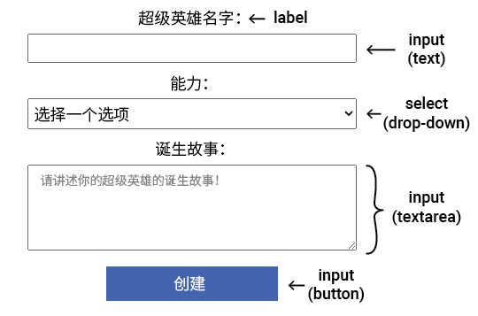

HTML 中的表单元素允许用户输入数据、与页面交互以及提交信息。



\--- collapse ---

---

## title: 表单元素的类型

以下是一些有用的表单元素：

- `<input>` 例如，单行文本框、复选框或按钮
- `<select>` 下拉列表
- `<textarea>` 用于输入多行文本
- `<label>` 文本告诉用户要输入什么信息

\--- /collapse ---

`<input>` 元素可以使用 `type` 属性以多种方式显示。

你可以使用 `type=` 设置输入的类型。

\--- collapse ---

---

## title: 输入类型示例

- **文本：** 单行文本。

  ```
    <input type="text">
  ```

**试试看**： <br><input type="text">

- **密码：** 隐藏输入的文本。

  ```
    <input type="password">
  ```

**试试看**： <br><input type="password">

- **复选框：** 勾选一个或多个选项。

  ```
    <input type="checkbox"> <label>早餐</label>
    <input type="checkbox"> <label>午餐</label>
  ```

**试试看**: <br><input type="checkbox"><label>早餐</label> <br><input type="checkbox"><label>午餐</label>

- **单选框：** 从一组选项中选择一个。

  ```
    <input type="radio" name="meal"> <label>早餐</label>
    <input type="radio" name="meal"> <label>午餐</label>
  ```

**试试看**： <br><input type="radio" name="meal"><label>早餐</label> <br><input type="radio" name="meal"><label>午餐</label> <br>**提示：** 单选按钮必须具有相同的 `name` 属性，以便选择一个单选按钮会取消选择任何其他选定的单选按钮。

- **数字** 带有箭头的数字数据，用于增加/减少值。

  ```
    <input type="number">
    
  ```

**试试看**: <br><input type="number">

\--- /collapse ---

你可以向 `<input>` 元素添加属性来帮助用户并控制可以输入的内容。

\--- collapse ---

---

## title: 输入属性示例

- 占位符：提供用户应输入内容的提示。 当用户输入值时它会被替换。
  示例: `<input type="text" placeholder="Enter your name">` <br><input type="text" placeholder="Enter your name">

- 值：设置输入字段中的默认数据。 例如，在询问用户饮食要求的表格中，你可以将该字段的默认值设置为“无”。
  例如：`<input type="text" name="Dietary requirements" value="None">` <br><input type="text" name="Dietary requirements" value="None">

- 必需：在允许提交表单之前检查输入字段是否已填写。
  例如：`<input type="text" required>`

- 最大长度：设置文本或密码输入中允许的最大字符数。
  例如：`<input type="text" maxlength="3">` <br><input type="text" maxlength="3">

- 最小值和最大值：设置数字或日期输入的最小值和最大值。
  例如：`<input type="number" min="0" max="100">`

\--- /collapse ---
